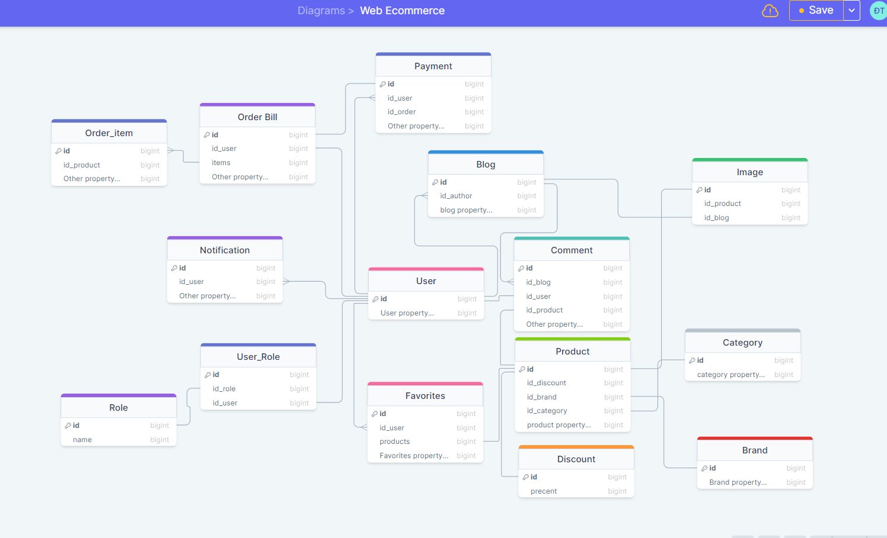
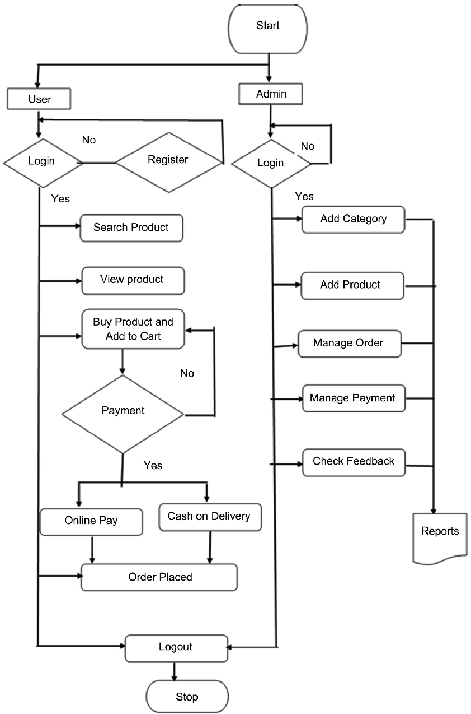

<h1>Source Code for Proeject Web Ecommerce</h1>
<h3> Description  </h5>

 This source code is built 100% with Java language and Spring Boot library . Use Maven For Project Management 

<h3> Architecture  </h5>

 RESTful API 

<h3>Technologies</h3>
<h5> Core </h5> 

-Java

<h5> Framework </h5>

- Spring Boot

- Spring Data JPA

- Spring Mail

- Spring Security 

-PDFbox

-JavaFaker

-Slugify

<h5>Tools</h5>

-IntelliJ IDEA

<h5>Databases</h5>

-MySQL

<h2 align="center"> Some Pictures </h2>
 
<h3>ER Diagram </h3>

<h3>Flowchart </h3>

